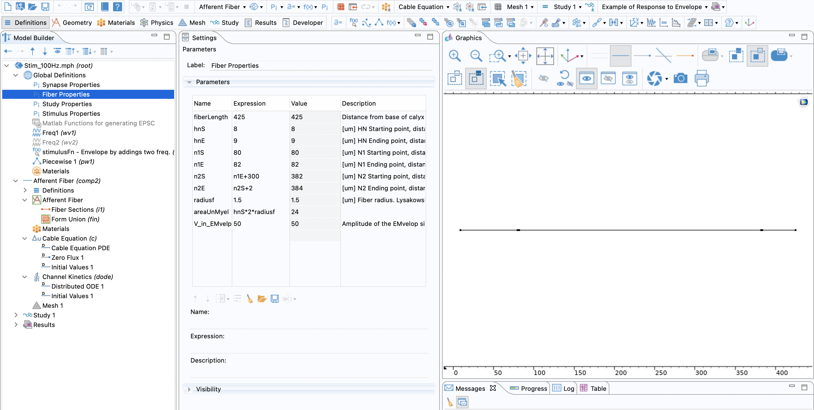

Code for plotting the results for Biophysics of amplitude-modulated giga-hertz electromagnetic waves stimulation. The data is generated by modeling a 1D model of a section of vestibular ganglion nerve fiber in COMSOL.

For complete details see: https://ieeexplore.ieee.org/abstract/document/10476737

The paper is also uploaded here as pdf.

